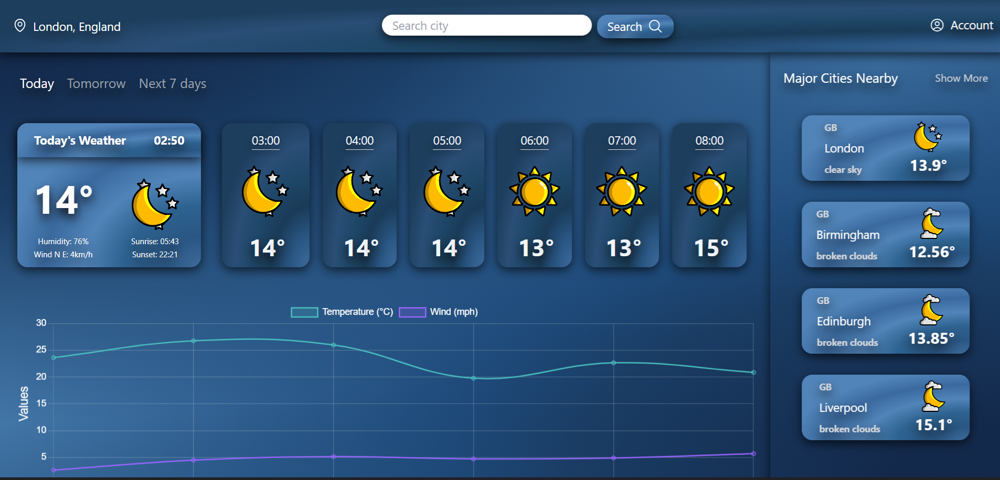

# Weather Dashboard 🌦️

## Tagline

**Stay Ahead with Accurate and Detailed Weather Forecasts 🌤️**

## Description

Weather Dashboard is a feature-rich weather application that provides detailed weather forecasts for any city or country you search. Utilizing the power of OpenWeather, GeoNames, and OpenStreetMap APIs, it offers options to view:

- **Today's Weather ☀️**: Current weather conditions with hourly forecasts.
- **Tomorrow's Weather 🌧️**: Detailed weather for the upcoming day with hourly breakdowns.
- **7-Day Forecast 📅**: Comprehensive forecast for the next week.
- **Nearby Cities 🏙️**: Suggestions of nearby cities with quick access to their forecasts.

Additionally, the app integrates **React Charts 📊** to graphically display temperature and wind speed trends for the selected forecast periods. The user interface is crafted using **Tailwind CSS 🎨** and **React ⚛️**, ensuring a seamless and responsive experience.

## Live Demo

[Explore the Weather Dashboard](https://weather-dashboard-pi-five.vercel.app/)

---

## Table of Contents

1. [Features](#features)
2. [Screenshots](#screenshots)
3. [Installation](#installation)
4. [Usage](#usage)
5. [Support](#support)
6. [License](#license)

---

## Features

- **Global Weather Search 🌍**: Get weather forecasts for any city or country worldwide.
- **Daily and Hourly Forecasts ⏰**: Detailed weather insights for today and tomorrow with hourly updates.
- **Extended Forecasts 📅**: 7-day weather forecast for long-term planning.
- **Nearby Cities 🏙️**: Explore weather conditions in cities near your searched location.
- **Interactive Charts 📊**: Visualize temperature and wind speed trends using dynamic charts.
- **Responsive Design 📱**: Tailored with Tailwind CSS for an optimal user experience across devices.

## Screenshots

### Main Dashboard



## Installation

To set up and run the Weather Dashboard locally, follow these steps:

1. **Clone the Repository 🖥️**
   ```bash
   git clone https://github.com/abdinasir1warsame/weather-dashboard.git
   ```
2. **Navigate to the Project Directory**

   ```bash
   cd WEATHER-DASHBOARD
   ```

3. **Install Dependencies**
   ```bash
   npm install
   ```
4. **Install Dependencies**

   ```bash
   npm start
   ```
